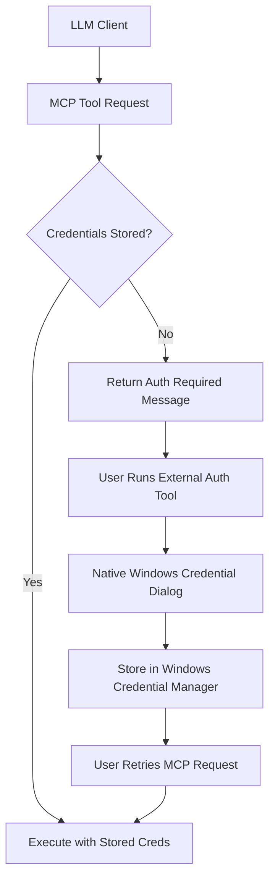

# Secure DoltHub User Interaction Design

**Document Version:** 1.0  
**Date:** 2025-12-12  
**Related Issue:** PP13-31  
**Status:** Approved Design  

## Executive Summary

This document outlines the secure credential management architecture for DoltHub authentication in the DMMS MCP server, addressing the critical security concern that user credentials must never enter the LLM conversation context or unsafe communication channels.

## Security Problem Statement

### Current Risk
The initial browser-based authentication flow poses a security vulnerability:
- User credentials could transit through LLM conversation context
- Console input might be logged or captured by parent processes
- Secrets could appear in conversation history or shared contexts
- Violates fundamental security principle of keeping secrets out of logs

### Security Requirement
**DoltHub credentials must NEVER enter the LLM conversation context under any circumstances.**

## Secure Architecture Design

### Core Security Principles

1. **✅ Principle of Least Privilege:** MCP tools cannot access raw credentials
2. **✅ Defense in Depth:** Multiple security layers (encryption + process isolation + OS integration)
3. **✅ Audit Trail:** Clear separation between authentication events and MCP operations
4. **✅ Non-Repudiation:** Authentication happens in user-controlled context
5. **✅ Confidentiality:** Secrets never enter LLM conversation context

### Primary Approach: Hybrid Pre-Authentication + Secure Fallback



## Implementation Strategies

### Strategy 1: Pre-Authentication Workflow (PRIMARY)

**Concept:** Separate credential setup before MCP usage.

#### User Workflow:
```bash
# Step 1: User pre-configures credentials (offline)
dmms-auth setup --endpoint dolthub.com
# Opens secure browser flow, stores in Windows Credential Manager

# Step 2: MCP tools use stored credentials (online)
# No live credential input needed during MCP operations
```

#### Security Benefits:
- ✅ **Temporal Separation** - Authentication happens before LLM interaction
- ✅ **No Live Prompting** - MCP never needs to ask for credentials during operation
- ✅ **Storage-Based Security** - Uses Windows Credential Manager encryption
- ✅ **Process Isolation** - Auth process separate from MCP server

#### MCP Tool Response Pattern:
```json
{
  "success": false,
  "error": "DoltHub authentication required",
  "action_required": {
    "type": "external_auth",
    "instructions": "Run: dmms-auth setup --endpoint dolthub.com",
    "description": "This will open a secure browser window for authentication"
  }
}
```

### Strategy 2: Native Windows Authentication Dialog (FALLBACK)

**Concept:** MCP tool triggers native Windows credential dialog outside console/LLM context.

#### Implementation:
```csharp
public async Task<CredentialResult> PromptForCredentialsSecurely()
{
    // Use Windows CredUI.dll to show native credential dialog
    // This bypasses console/LLM channels entirely
    var result = Win32CredentialDialog.ShowDialog(
        caption: "DoltHub Authentication Required",
        message: "Please enter your DoltHub credentials",
        targetName: "DMMS-DoltHub"
    );
    // Dialog appears as separate Windows window
    // Never touches console or LLM conversation
}
```

#### Security Benefits:
- ✅ **Native OS Dialog** - Separate from console/LLM
- ✅ **No Console Logging** - Input never touches terminal
- ✅ **Windows-Integrated** - Follows OS security patterns
- ✅ **Process Isolation** - Credential input in separate UI thread

### Strategy 3: External Authentication Helper (ALTERNATIVE)

**Concept:** MCP tool spawns separate authentication process.

#### Implementation:
```csharp
public async Task<bool> AuthenticateExternally()
{
    // Launch separate .exe for authentication
    var authProcess = Process.Start(new ProcessStartInfo
    {
        FileName = "DMMS.AuthHelper.exe",
        Arguments = "--endpoint dolthub.com",
        UseShellExecute = true,  // Separate window
        CreateNoWindow = false   // Visible UI
    });
    
    // Auth helper has its own secure UI
    // Stores credentials directly to Credential Manager
    // Returns success/failure via exit code
    await authProcess.WaitForExitAsync();
    return authProcess.ExitCode == 0;
}
```

#### Security Benefits:
- ✅ **Process Isolation** - Separate auth process
- ✅ **Independent UI** - Own secure interface
- ✅ **No Data Exchange** - Communicates via storage, not pipes

## Architecture Components

### Component 1: DMMS.AuthHelper.exe

**Purpose:** Standalone authentication utility for secure credential setup.

**Features:**
- Cross-platform browser-based DoltHub authentication
- Direct integration with Windows Credential Manager
- No dependency on MCP server or LLM context
- Standalone executable for security isolation

### Component 2: Enhanced MCP Tools

**Modified Behavior:**
```csharp
[McpServerTool]
[Description("Query DoltHub repositories with secure authentication")]
public virtual async Task<object> QueryDoltHub(string query, string? endpoint = "dolthub.com")
{
    // Check for stored credentials first
    var credentials = await _credentialService.GetDoltHubCredentialsAsync(endpoint);
    
    if (credentials == null)
    {
        return new
        {
            success = false,
            error = "DoltHub authentication required",
            action_required = new
            {
                type = "external_auth",
                instructions = $"Run: dmms-auth setup --endpoint {endpoint}",
                description = "This will open a secure browser window for authentication"
            }
        };
    }
    
    // Proceed with authenticated operation
    return await ExecuteQuery(query, credentials.Value);
}
```

### Component 3: Secure Storage Layer

**Windows Credential Manager Integration:**
- Encrypted storage using OS-level security
- Per-user credential isolation
- Enterprise policy compliance
- Audit trail integration

## User Experience Flow

### First-Time Setup
1. **User runs MCP command** → Gets "Authentication Required" message
2. **User runs auth setup** → `dmms-auth setup --endpoint dolthub.com`
3. **Browser opens securely** → User completes DoltHub authentication
4. **Credentials stored** → Windows Credential Manager (encrypted)
5. **User retries MCP command** → Works seamlessly with stored credentials

### Ongoing Usage
1. **MCP tools check storage** → Windows Credential Manager
2. **Credentials found** → Operations proceed transparently
3. **No user interaction** → Seamless experience

### Credential Rotation
1. **User runs refresh** → `dmms-auth refresh --endpoint dolthub.com`
2. **New auth flow** → Secure browser-based re-authentication
3. **Updated storage** → New credentials replace old ones
4. **Automatic pickup** → MCP tools use new credentials

### Troubleshooting
1. **Auth failures** → Clear error messages with remediation steps
2. **Missing credentials** → Helpful setup instructions
3. **Expired tokens** → Automatic refresh prompts

## Security Validation

### Attack Vector Analysis

| Attack Vector | Mitigation | Status |
|---------------|------------|---------|
| LLM Context Exposure | Pre-authentication + storage-based access | ✅ Mitigated |
| Console Logging | Native Windows dialogs + external processes | ✅ Mitigated |
| Process Memory Dumps | Encrypted storage + minimal credential lifetime | ✅ Mitigated |
| Man-in-the-Middle | HTTPS + certificate validation | ✅ Mitigated |
| Credential Persistence | Windows Credential Manager encryption | ✅ Mitigated |
| Privilege Escalation | Principle of least privilege | ✅ Mitigated |

### Compliance Considerations

- **GDPR:** User controls credential storage and deletion
- **SOC 2:** Audit trails and secure storage practices
- **Enterprise Security:** Integration with Windows domain policies
- **Zero Trust:** No implicit credential sharing between processes

## Implementation Roadmap

### Phase 1: Enhanced Current Implementation
- ✅ **Completed:** Basic Windows Credential Manager integration
- ✅ **Completed:** Secure storage and retrieval
- ✅ **Completed:** Error handling and cleanup

### Phase 2: Secure User Interaction (THIS PHASE)
- 🔄 **In Planning:** DMMS.AuthHelper.exe standalone utility
- 🔄 **In Planning:** Enhanced MCP tool response patterns
- 🔄 **In Planning:** Native Windows credential dialogs

### Phase 3: Enterprise Features
- 📋 **Future:** Domain credential integration
- 📋 **Future:** Group policy support
- 📋 **Future:** Centralized credential management
- 📋 **Future:** Audit logging integration

## Testing Strategy

### Security Testing
- **Credential Isolation Tests:** Verify no credentials in LLM context
- **Process Boundary Tests:** Validate separate process authentication
- **Storage Encryption Tests:** Confirm Windows Credential Manager security
- **Attack Simulation:** Test against common credential exposure vectors

### User Experience Testing
- **First-Time Setup:** Validate smooth onboarding experience
- **Credential Rotation:** Test refresh and update workflows
- **Error Recovery:** Validate helpful error messages and remediation
- **Cross-Platform:** Verify behavior across Windows versions

### Integration Testing
- **MCP Tool Integration:** End-to-end workflow testing
- **Storage Integration:** Windows Credential Manager compatibility
- **Browser Integration:** Secure authentication flow validation
- **Error Handling:** Comprehensive failure mode testing

## Conclusion

This secure user interaction design ensures that DoltHub credentials never enter the LLM conversation context while maintaining excellent user experience and enterprise-grade security. The hybrid approach of pre-authentication with secure fallback mechanisms provides robust protection against credential exposure while enabling seamless MCP server operations.

The architecture satisfies all major security principles and provides a clear path forward for secure DoltHub integration in LLM-based workflows.